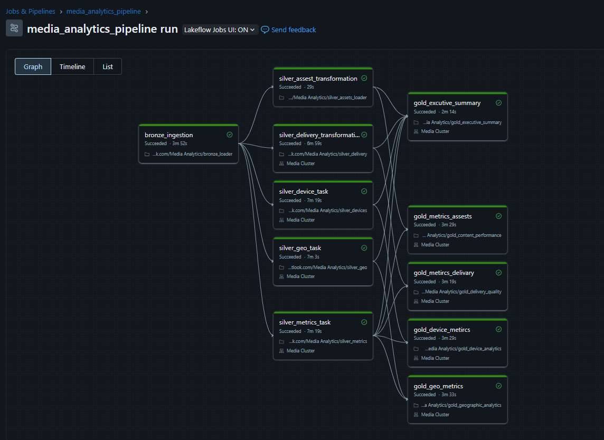

# Media Analytics Pipeline - Data Engineering Documentation

A production-grade data engineering pipeline built on Azure Databricks implementing the **Medallion Architecture** (Bronze → Silver → Gold) for media analytics and content performance tracking.

## 📊 Pipeline Overview



This pipeline processes media analytics data through three layers:
- **Bronze Layer**: Raw data ingestion
- **Silver Layer**: Cleaned and transformed data
- **Gold Layer**: Business-level aggregations and analytics

### Pipeline Architecture

```
┌─────────────────┐
│  Bronze Layer   │  Raw data ingestion from source systems
│  (Ingestion)    │
└────────┬────────┘
         │
         ▼
┌─────────────────┐
│  Silver Layer   │  Data cleaning, transformation, validation
│ (Transformation)│  ├─ Assets
└────────┬────────┘  ├─ Delivery metrics
         │           ├─ Device data
         │           ├─ Geographic data
         │           └─ Performance metrics
         ▼
┌─────────────────┐
│   Gold Layer    │  Business aggregations & analytics
│  (Analytics)    │  ├─ Executive Summary
└─────────────────┘  ├─ Content Performance
                     ├─ Delivery Quality
                     ├─ Device Analytics
                     └─ Geographic Analytics
```

## 🎯 Job Workflow Details

### Task Dependencies

The pipeline consists of **10 tasks** organized in 3 stages:

#### **Stage 1: Bronze Ingestion**
- **`bronze_ingestion`**
  - **Purpose**: Ingest raw data from source systems
  - **Notebook**: `notebooks/bronze_loader`
  - **Cluster**: Media Cluster
  - **Duration**: ~3m 52s
  - **Output**: Bronze Delta tables

#### **Stage 2: Silver Transformation** (Parallel Processing)
After bronze ingestion completes, 5 silver tasks run in parallel:

1. **`silver_assest_transformation`** ✓
   - **Notebook**: `silver_assest_loader`
   - **Duration**: ~29s
   - **Purpose**: Transform asset metadata and attributes
   
2. **`silver_delivery_transformation`** ✓
   - **Notebook**: `silver_delivery`
   - **Duration**: ~6m 59s
   - **Cluster**: Media Cluster
   - **Purpose**: Process delivery metrics and streaming data
   
3. **`silver_device_task`** ✓
   - **Notebook**: `silver_devices`
   - **Duration**: ~7m 19s
   - **Cluster**: Media Cluster
   - **Purpose**: Analyze device types, platforms, and capabilities
   
4. **`silver_geo_task`** ✓
   - **Notebook**: `silver_geo`
   - **Duration**: ~7m 3s
   - **Cluster**: Media Cluster
   - **Purpose**: Process geographic and location data
   
5. **`silver_metrics_task`** ✓
   - **Notebook**: `silver_metrics`
   - **Duration**: ~7m 19s
   - **Cluster**: Media Cluster
   - **Purpose**: Transform performance and engagement metrics

#### **Stage 3: Gold Analytics** (Parallel Processing)
After silver layer completes, 5 gold tasks run in parallel:

1. **`gold_executive_summary`** ✓
   - **Notebook**: `gold_executive_summary`
   - **Duration**: ~2m 14s
   - **Cluster**: Media Cluster
   - **Purpose**: High-level KPIs and executive dashboards
   
2. **`gold_metrics_assets`** ✓
   - **Notebook**: `gold_content_performance`
   - **Duration**: ~3m 29s
   - **Cluster**: Media Cluster
   - **Purpose**: Content performance and asset analytics
   
3. **`gold_metrics_delivery`** ✓
   - **Notebook**: `gold_delivery_quality`
   - **Duration**: ~3m 19s
   - **Cluster**: Media Cluster
   - **Purpose**: Delivery quality metrics and CDN performance
   
4. **`gold_device_metrics`** ✓
   - **Notebook**: `gold_device_analytics`
   - **Duration**: ~3m 29s
   - **Cluster**: Media Cluster
   - **Purpose**: Device usage patterns and compatibility analysis
   
5. **`gold_geo_metrics`** ✓
   - **Notebook**: `gold_geographic_analytics`
   - **Duration**: ~3m 33s
   - **Cluster**: Media Cluster
   - **Purpose**: Geographic distribution and regional insights

## 📁 Project Structure

```
Asset Bundles/
├── databricks.yml                      # DAB configuration (multi-env)
├── resources/
│   └── jobs/
│       └── data_pipeline_job.yml      # Job definition
├── notebooks/
│   ├── bronze_loader.ipynb            # Bronze layer ingestion
│   ├── silver_assets_loader.ipynb     # Silver: Assets transformation
│   ├── silver_delivery.ipynb          # Silver: Delivery metrics
│   ├── silver_devices.ipynb           # Silver: Device data
│   ├── silver_geo.ipynb               # Silver: Geographic data
│   ├── silver_metrics.ipynb           # Silver: Performance metrics
│   ├── gold_executive_summary.ipynb   # Gold: Executive KPIs
│   ├── gold_content_performance.ipynb # Gold: Content analytics
│   ├── gold_delivery_quality.ipynb    # Gold: Delivery quality
│   ├── gold_device_analytics.ipynb    # Gold: Device insights
│   ├── gold_geographic_analytics.ipynb# Gold: Geographic analytics
│   └── config.py                      # Shared configuration
├── parquet_data_source/               # Source Parquet files
│   ├── assets.parquet
│   ├── delivery.parquet
│   ├── devices.parquet
│   ├── geo.parquet
│   └── metrics.parquet
├── csv_data_source/                   # CSV exports
├── config/                            # Environment configs
│   ├── dev.json
│   └── prod.json
└── scripts/                           # Deployment scripts
    ├── deploy.ps1
    └── deploy.sh
```

## 🗄️ Data Model

### Bronze Layer Tables
```
bronze.raw_assets       - Raw asset metadata from CMS
bronze.raw_delivery     - Raw delivery logs from CDN
bronze.raw_devices      - Raw device information
bronze.raw_geo          - Raw geographic data
bronze.raw_metrics      - Raw performance metrics
```

### Silver Layer Tables
```
silver.assets          - Cleaned asset attributes
silver.delivery        - Processed delivery metrics
silver.devices         - Standardized device data
silver.geo             - Normalized geographic data
silver.metrics         - Validated performance metrics
```

### Gold Layer Tables
```
gold.executive_summary      - Executive KPIs and trends
gold.content_performance    - Content engagement metrics
gold.delivery_quality       - CDN and streaming quality
gold.device_analytics       - Device usage patterns
gold.geographic_analytics   - Regional performance insights
```

## 🚀 Getting Started

### Prerequisites
- Azure Databricks workspace
- Databricks CLI installed: `pip install databricks-cli`
- Access to source data storage (ADLS/S3/DBFS)

### Initial Setup

1. **Configure Databricks CLI**
   ```bash
   databricks configure --token
   ```

2. **Update Configuration**
   Edit `databricks.yml` and replace workspace IDs:
   ```yaml
   workspace:
     host: https://adb-<your-workspace-id>.azuredatabricks.net
   ```

3. **Deploy Bundle**
   ```powershell
   # Windows
   .\scripts\deploy.ps1 -Environment dev
   
   # Linux/Mac
   ./scripts/deploy.sh dev
   ```

4. **Run Pipeline**
   ```bash
   databricks bundle run media_analytics_pipeline -t dev
   ```

## 📈 Pipeline Execution

### Manual Run
```bash
# Run entire pipeline
databricks bundle run media_analytics_pipeline -t prod

# Run with parameters
databricks bundle run media_analytics_pipeline -t prod --params date=2024-01-15
```

### Scheduled Run
The pipeline is configured to run:
- **DEV**: On-demand
- **QA**: Daily at 2 AM UTC
- **UAT**: Daily at 1 AM UTC
- **PROD**: Daily at 1 AM UTC

### Monitoring

**View in Databricks UI:**
1. Navigate to **Workflows** → **Jobs**
2. Find job: `media_analytics_pipeline-{env}`
3. View run history, task logs, and metrics

**CLI Monitoring:**
```bash
# Check job status
databricks jobs list | grep media_analytics_pipeline

# View latest run
databricks jobs runs list --job-id <job-id> --limit 1

# Get run details
databricks jobs runs get --run-id <run-id>

# View task logs
databricks jobs runs get-output --run-id <run-id>
```

## ⚙️ Configuration

### Environment Variables

Each environment uses different data paths and cluster configurations:

| Setting | DEV | QA | PROD |
|---------|-----|-----|------|
| **Data Path** | `/mnt/dev/media_analytics` | `/mnt/qa/media_analytics` | `/mnt/prod/media_analytics` |
| **Cluster Size** | 2 workers | 2 workers | 5-10 workers (autoscale) |
| **Cluster Type** | Standard_DS3_v2 | Standard_DS3_v2 | Standard_DS5_v2 |
| **Max Retries** | 1 | 2 | 2 |
| **Timeout** | 1 hour | 2 hours | 4 hours |

### Cluster Configuration

**Media Cluster Specifications:**
- **Spark Version**: 13.3.x-scala2.12
- **Node Type**: Standard_DS3_v2 (DEV/QA) or Standard_DS5_v2 (PROD)
- **Workers**: 2-10 depending on environment
- **Autoscaling**: Enabled for PROD
- **Auto-termination**: 30 minutes (DEV), 60 minutes (PROD)

### Performance Optimization

The pipeline uses several optimization techniques:

1. **Parallel Processing**: Silver and Gold tasks run concurrently
2. **Delta Lake**: ACID transactions and time travel
3. **Z-Ordering**: Optimized data layout for frequent queries
4. **Auto-Compaction**: Small file consolidation
5. **Partition Pruning**: Date-based partitioning strategy

## 🔄 CI/CD Pipeline

### Branching Strategy
```
feature/* → develop → DEV environment (auto)
develop → main → QA environment (auto + tests)
main → release/* → UAT environment (manual approval)
release/* → prod tag → PROD environment (manual approval + backup)
```

### GitHub Actions Workflow

Automated deployment triggers:
- **Push to `develop`**: Auto-deploy to DEV
- **Push to `main`**: Auto-deploy to QA + run integration tests
- **Push to `release/*`**: Deploy to UAT (requires approval)
- **Manual workflow**: Deploy to PROD (requires approval + creates backup)

### Deployment Commands

```bash
# Validate bundle
databricks bundle validate -t <env>

# Deploy to environment
databricks bundle deploy -t <env>

# Run pipeline
databricks bundle run media_analytics_pipeline -t <env>

# Destroy deployment (cleanup)
databricks bundle destroy -t <env>
```

## 🔐 Security & Secrets

### Secret Management

Secrets are stored in Databricks secret scopes:

```python
# In notebooks
storage_key = dbutils.secrets.get(scope="prod-secrets", key="storage-account-key")
api_key = dbutils.secrets.get(scope="prod-secrets", key="api-key")
```

### Creating Secrets

```bash
# Create secret scope
databricks secrets create-scope --scope prod-secrets

# Add secrets
databricks secrets put --scope prod-secrets --key storage-account-key
```

### Azure Key Vault Integration

For production, link to Azure Key Vault:
```bash
databricks secrets create-scope \
  --scope prod-secrets \
  --scope-backend-type AZURE_KEYVAULT \
  --resource-id /subscriptions/<sub-id>/resourceGroups/<rg>/providers/Microsoft.KeyVault/vaults/<vault>
```

## 📊 Data Quality Checks

Each silver notebook includes data quality validations:

```python
# Example quality checks
assert df.count() > 0, "Empty dataset"
assert df.filter(col("id").isNull()).count() == 0, "Null IDs found"
assert df.select("date").distinct().count() == 1, "Multiple dates in batch"
```

## 🐛 Troubleshooting

### Common Issues

#### Pipeline Failure
```bash
# Check logs
databricks jobs runs get-output --run-id <run-id>

# Check specific task
databricks jobs runs get --run-id <run-id> | jq '.tasks[] | select(.task_key=="bronze_ingestion")'
```

#### Data Quality Issues
- Check bronze layer data completeness
- Verify source data schema matches expectations
- Review silver transformation logic for edge cases

#### Performance Issues
- Monitor cluster metrics in Databricks UI
- Check for data skew in partitions
- Optimize join strategies and broadcast hints

### Debug Mode

Enable debug logging in notebooks:
```python
spark.conf.set("spark.sql.adaptive.enabled", "true")
spark.conf.set("spark.databricks.delta.optimizeWrite.enabled", "true")

# Add debug logging
import logging
logging.basicConfig(level=logging.DEBUG)
```

## 📈 Performance Metrics

### Typical Run Times (PROD)

| Stage | Duration | Tasks |
|-------|----------|-------|
| Bronze Ingestion | ~4 min | 1 task |
| Silver Transformation | ~7 min | 5 tasks (parallel) |
| Gold Analytics | ~4 min | 5 tasks (parallel) |
| **Total Pipeline** | **~15 min** | **11 tasks** |

### SLAs

- **DEV**: Best effort
- **QA**: < 30 minutes
- **UAT**: < 20 minutes
- **PROD**: < 20 minutes (with retries)

## 🔍 Monitoring & Alerts

### Health Checks

Configured in `databricks.yml`:
```yaml
health:
  rules:
    - metric: RUN_DURATION_SECONDS
      op: GREATER_THAN
      value: 7200  # 2 hours
```

### Notifications

**Email Alerts** (configured per environment):
- **DEV**: On failure only
- **QA**: On failure
- **UAT**: On failure
- **PROD**: On start, success, and failure

**Slack Integration**:
Configure webhook in GitHub secrets for CI/CD notifications.

## 🎓 Best Practices

### Data Engineering Principles

1. **Idempotency**: All transformations are rerunnable
2. **Incremental Processing**: Use Delta Lake merge for efficiency
3. **Schema Evolution**: Handle schema changes gracefully
4. **Data Lineage**: Track data flow through layers
5. **Testing**: Unit tests for transformations, integration tests for pipeline

### Code Standards

```python
# Use parameters, not hardcoded values
input_path = dbutils.widgets.get("input_path")
environment = dbutils.widgets.get("environment")

# Defensive programming
df = spark.read.parquet(input_path)
assert df.count() > 0, f"No data found in {input_path}"

# Proper error handling
try:
    df.write.format("delta").mode("overwrite").saveAsTable("silver.assets")
    dbutils.notebook.exit(json.dumps({"status": "success"}))
except Exception as e:
    dbutils.notebook.exit(json.dumps({"status": "failed", "error": str(e)}))
```

## 📚 Additional Resources

- [Databricks Asset Bundles Documentation](https://docs.databricks.com/dev-tools/bundles/index.html)
- [Delta Lake Best Practices](https://docs.databricks.com/delta/best-practices.html)
- [Medallion Architecture Guide](https://docs.databricks.com/lakehouse/medallion.html)
- [Job Orchestration](https://docs.databricks.com/workflows/jobs/jobs.html)

## 🤝 Contributing

1. Create feature branch: `git checkout -b feature/new-transformation`
2. Develop and test locally in DEV environment
3. Create pull request to `develop` branch
4. After approval, auto-deploys to DEV
5. Promote through QA → UAT → PROD

## 📝 Change Log

### Version 1.0.0 (Current)
- Initial medallion architecture implementation
- Bronze layer: Raw data ingestion
- Silver layer: 5 transformation pipelines
- Gold layer: 5 analytics aggregations
- Multi-environment deployment (DEV/QA/UAT/PROD)
- CI/CD with GitHub Actions

## 📧 Support

For issues or questions:
- Check job logs in Databricks UI
- Review troubleshooting section above
- Contact data engineering team

---

**Pipeline Status**: ✅ All tasks completed successfully  
**Last Run**: Check Databricks UI for latest execution  
**Total Duration**: ~15 minutes (typical PROD run)
